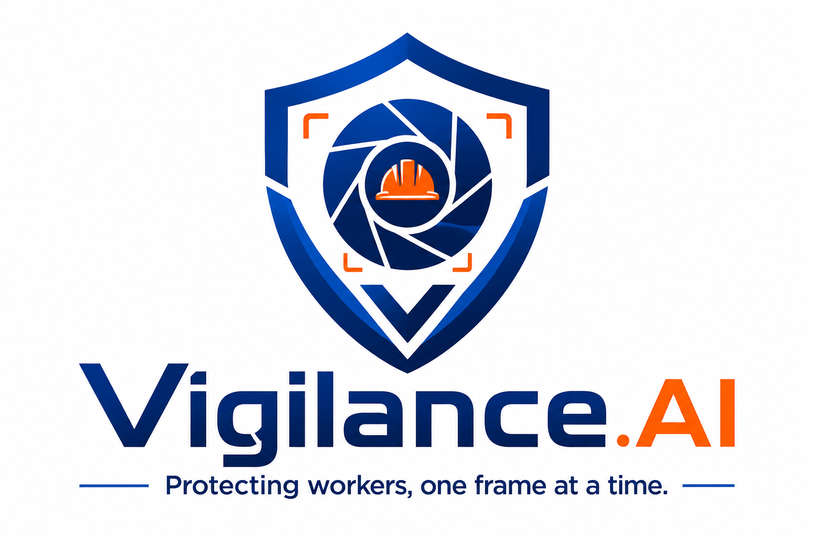

<p align="center">
  
</p>

<h1 align="center">Vigilance.AI</h1>

<p align="center">
  <em>Protecting workers, one frame at a time.</em>
</p>

---

## 🛡️ What is Vigilance.AI?

An AI-powered worker safety monitoring system that uses computer vision to detect whether factory workers are wearing proper PPE (Personal Protective Equipment). If a violation is detected, the system triggers an alarm and notifies the factory manager instantly.

---

## 🚀 Project Phases

| Phase | Title | Status |
|-------|-------|--------|
| Phase 1 | Basic Detection | 🔄 In Progress |
| Phase 2 | Alert System | ⏳ Upcoming |
| Phase 3 | Intelligence | ⏳ Upcoming |
| Phase 4 | Scale | ⏳ Upcoming |
| Phase 5 | Product | ⏳ Upcoming |

See full roadmap → [`Vigilance_AI_Roadmap.pdf`](Vigilance_AI_Roadmap.pdf)

---

## 🧠 Tech Stack
- Python
- OpenCV
- YOLOv8 (Ultralytics)
- Twilio API
- Flask

---

## 📁 Project Structure

```
Vigilance.AI/
├── assets/
│   └── logo.png
├── data/
├── src/
│   ├── detect.py
│   └── utils.py
├── Phase1.md
├── Vigilance_AI_Roadmap.pdf
└── requirements.txt
```
---

Built with purpose. In memory of those lost to preventable accidents.

⭕️Ụ⭕️
